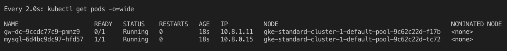
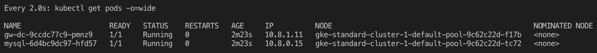

# Deploying the Layer7 API Gateway to a Kubernetes cluster

This folder contains everything you need to deploy a fresh new gateway to your k8s cluster. Please refer to the [official documentation](https://docops.ca.com/ca-api-gateway/9-4/en/other-gateway-form-factors/using-the-container-gateway/getting-started-with-the-container-gateway/run-the-container-gateway-on-kubernetes) showing how to deploy the gateway on Kubernetes.

## Introduction

Make sure you have your API gateway license file copied to the folder **../config/licenses/ssg_license.xml**. The official documentation mentions that a secret should be used in order to safely pass the gateway license base64 hash. However this is not safe once you would need to have the base64 endoded string hard coded into your config.yml kubernetes deployment file. I came up with a solution where you can isolate your **ssg_license.xml** and not have it flowing hard coded into your files. This allows for a much easier integration with your CI/CD pipeline, once a shell script will replace the **YOUR_LICENSE_HERE** with the base64 hash generated on the fly.

If you pay atention to the **Makefile**, you'll find a reference to the shell script **prepare.sh**. There is also a make target to reset the license, which can be very handy in case you need to share your files on an open wire.

## Pre-requisites

The only thing you need is an working Kubernetes cluster along with its CLI, the **kubectl**. The Makefile will do the work for you.

## Deploying the application to your Kubernetes cluster

### Checking your cluster

Run the following command to obtain information about your cluster:
```bash
make k8s
```
### Deploying the API Gateway to your cluster

Run the following and wait until the gateway pod is ready:
```bash
make deploy
```

Watch for the READY and STATUS to change to 1/1 and Running respectively:


This is what you want:


if you want to check the logs of either your gateway of the mysql pod, just copy the name of it (NAME from previous image) and type the following:

```bash
kubectl logs pod_name -f
```

### Stopping and starting fresh

Use the following target to stop and destroy everything. This is handy when you need to fire up another gateway to test but don't want to store anything.

```bash
make clean
```
